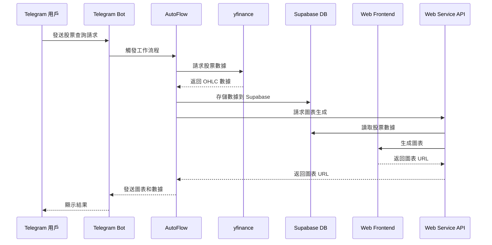

# AutoFlow 工作流自動化框架

## 專案概述

AutoFlow 是一個強大的工作流自動化框架，提供了一個完整的解決方案，用於創建和管理自動化工作流程。它支持異步操作、錯誤處理、日誌記錄等功能，使工作流程的開發和管理變得簡單而高效。

## 安裝

```bash
# 開發模式安裝
pip install -e .

# 或直接安裝
pip install autoflow
```

## 使用方式

### 作為包使用

```python
from autoflow import Flow, Config

# 創建配置
config = Config(
    name="my_flow",
    description="示例工作流程"
)

# 創建工作流程
class MyFlow(Flow):
    async def handle_message(self, message):
        # 處理消息
        pass

# 使用工作流程
flow = MyFlow(config)
await flow.start()
```

### 命令行使用

```bash
# 運行工作流程
autoflow run path/to/flow.py

# 停止工作流程
autoflow stop path/to/flow.py

# 查看狀態
autoflow status path/to/flow.py
```

## 目錄結構

```
autoflow/
├── core/           # 核心組件
├── flows/          # 工作流程
├── services/       # 服務
└── utils/          # 工具函數
```

## 主要功能

1. 工作流程管理
   - 工作流程定義
   - 狀態管理
   - 錯誤處理
   - 重試機制

2. 異步支持
   - 異步操作
   - 事件處理
   - 消息處理

3. 工具支持
   - 日誌記錄
   - 配置管理
   - 工具函數

## 注意事項

1. 確保在虛擬環境中安裝
2. 檢查依賴版本兼容性
3. 注意異步操作的正確使用
4. 合理配置錯誤處理和重試策略

## 依賴套件

### 核心依賴
- aiohttp: 異步 HTTP 客戶端
- pydantic: 數據驗證
- loguru: 日誌管理
- python-telegram-bot: Telegram 機器人支持
- supabase: 數據庫支持
- playwright: 瀏覽器自動化

### 開發依賴
- pytest: 測試框架
- black: 代碼格式化
- isort: 導入排序
- mypy: 類型檢查

## 環境設置

### 1. 創建虛擬環境

```bash
# 進入 autoflow 目錄
cd autoflow

# 創建虛擬環境
python -m venv venv

# 啟動虛擬環境
# Windows
venv\Scripts\activate
# macOS/Linux
source venv/bin/activate
```

### 2. 安裝依賴

```bash
# 安裝依賴套件
pip install -r requirements.txt
```

### 3. 環境變數設置

在專案根目錄創建 `.env` 文件，添加以下配置：

```env
# Telegram Bot 配置
TELEGRAM_BOT_TOKEN=your_telegram_bot_token_here

# Supabase 配置
SUPABASE_URL=your_supabase_url_here
SUPABASE_KEY=your_supabase_key_here
```

## 範例：股票行情查詢機器人

以下是一個使用 AutoFlow 實現的股票行情查詢機器人工作流程。該機器人允許用戶通過 Telegram 查詢股票行情，並返回相關的圖表和數據。

### 工作流程圖



### 工作流程說明

1. **觸發器**：Telegram 用戶發送查詢請求
2. **數據獲取**：使用 yfinance 獲取股票數據
3. **數據存儲**：將數據存儲到 Supabase 數據庫
4. **圖表生成**：通過 Web 服務生成圖表
5. **結果返回**：將圖表和數據返回給用戶

### 技術組件

- **Telegram Bot**：用戶交互界面
- **yfinance**：股票數據源
- **Supabase**：數據存儲
- **Web Frontend**：圖表生成
- **Web Service API**：數據處理和圖表生成服務

## 開發指南

詳細的開發文檔請參考 

```sql
-- 用戶表
create table users (
    id bigint generated by default as identity primary key,
    telegram_id bigint not null unique,
    username text,
    first_name text,
    last_name text,
    created_at timestamptz not null,
    last_active timestamptz not null,
    status text not null default 'active',
    created_at timestamptz default now()
);

-- 對話歷史表
create table conversations (
    id bigint generated by default as identity primary key,
    user_id text not null references users(id),
    message text not null,
    response text not null,
    message_type text not null default 'stock_query',
    timestamp timestamptz not null,
    status text not null default 'success',
    created_at timestamptz default now()
);

-- 股票數據表
create table stock_data (
    id bigint generated by default as identity primary key,
    symbol text not null,
    date date not null,
    open decimal not null,
    high decimal not null,
    low decimal not null,
    close decimal not null,
    volume bigint not null,
    timestamp timestamptz not null,
    created_at timestamptz default now()
);

-- 創建索引
create index users_telegram_id_idx on users(telegram_id);
create index users_username_idx on users(username);
create index users_status_idx on users(status);
create index conversations_user_id_idx on conversations(user_id);
create index conversations_timestamp_idx on conversations(timestamp);
create index conversations_message_type_idx on conversations(message_type);
create index stock_data_symbol_idx on stock_data(symbol);
create index stock_data_date_idx on stock_data(date);

-- 檢查表是否存在
select exists (
    select from information_schema.tables 
    where table_name = 'users'
);

select exists (
    select from information_schema.tables 
    where table_name = 'conversations'
);

select exists (
    select from information_schema.tables 
    where table_name = 'stock_data'
);

-- 檢查表結構
select column_name, data_type 
from information_schema.columns 
where table_name = 'users';

select column_name, data_type 
from information_schema.columns 
where table_name = 'conversations';

select column_name, data_type 
from information_schema.columns 
where table_name = 'stock_data';

-- 檢查用戶表
select * from users order by created_at desc limit 5;

-- 檢查對話表
select * from conversations order by timestamp desc limit 5;

-- 檢查股票數據表
select * from stock_data order by timestamp desc limit 5;

create table public.bots (
    id bigint generated by default as identity primary key,
    bot_id bigint not null unique,
    username text not null,
    first_name text not null,
    is_bot boolean not null default true,
    can_join_groups boolean not null default false,
    can_read_all_group_messages boolean not null default false,
    supports_inline_queries boolean not null default false,
    created_at timestamp with time zone not null default now(),
    updated_at timestamp with time zone not null default now(),
    status text not null default 'active',
    constraint bots_bot_id_key unique (bot_id)
);

-- 設置 RLS 策略
alter table public.bots enable row level security;

-- 創建更新時間觸發器
create or replace function public.handle_updated_at()
returns trigger as $$
begin
    new.updated_at = now();
    return new;
end;
$$ language plpgsql;

create trigger set_updated_at
    before update on public.bots
    for each row
    execute function public.handle_updated_at();

-- 創建訪問策略
create policy "Enable read access for all users" on public.bots
    for select using (true);

create policy "Enable insert for authenticated users only" on public.bots
    for insert with check (auth.role() = 'authenticated');

create policy "Enable update for authenticated users only" on public.bots
    for update using (auth.role() = 'authenticated');
```