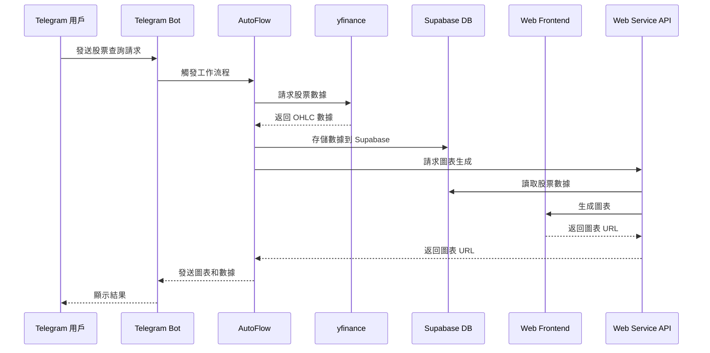

# AutoFlow 工作流自動化平台

## 專案概述

AutoFlow 是一個類似 make.com 和 n8n 的工作流自動化平台，用於整合各種服務和 API。本專案提供了一個完整的解決方案，用於創建和管理自動化工作流程。

## 環境設置

### 1. 創建虛擬環境

```bash
# 進入 autoflow 目錄
cd autoflow

# 創建虛擬環境
python -m venv venv

# 啟動虛擬環境
# Windows
venv\Scripts\activate
# macOS/Linux
source venv/bin/activate
```

### 2. 安裝依賴

```bash
# 安裝依賴套件
pip install -r requirements.txt
```

### 3. 環境變數設置

在專案根目錄創建 `.env` 文件，添加以下配置：

```env
# Telegram Bot 配置
TELEGRAM_BOT_TOKEN=your_telegram_bot_token_here

# Supabase 配置
SUPABASE_URL=your_supabase_url_here
SUPABASE_KEY=your_supabase_key_here
```

## 目錄結構

```
autoflow/
├── core/           # 核心組件
├── flows/          # 工作流程定義
├── services/       # 服務整合
└── utils/          # 工具函數
```

## 範例：股票行情查詢機器人

以下是一個使用 AutoFlow 實現的股票行情查詢機器人工作流程。該機器人允許用戶通過 Telegram 查詢股票行情，並返回相關的圖表和數據。

### 工作流程圖



### 工作流程說明

1. **觸發器**：Telegram 用戶發送查詢請求
2. **數據獲取**：使用 yfinance 獲取股票數據
3. **數據存儲**：將數據存儲到 Supabase 數據庫
4. **圖表生成**：通過 Web 服務生成圖表
5. **結果返回**：將圖表和數據返回給用戶

### 技術組件

- **Telegram Bot**：用戶交互界面
- **yfinance**：股票數據源
- **Supabase**：數據存儲
- **Web Frontend**：圖表生成
- **Web Service API**：數據處理和圖表生成服務

## 使用方式

### 執行股票機器人

```bash
# 確保在虛擬環境中
python flows/stock_bot_flow.py
```

### 開發新工作流程

1. 在 `flows/` 目錄下創建新的工作流程文件
2. 繼承 `Flow` 基類
3. 實現必要的方法
4. 在 `services/` 中添加所需的服務

## 注意事項

1. 確保在執行前已啟動虛擬環境
2. 檢查環境變數是否正確設置
3. 確保所有依賴都已正確安裝

## 依賴套件說明

- `python-dotenv`: 環境變數管理
- `supabase`: Supabase 資料庫客戶端
- `yfinance`: Yahoo Finance API 客戶端
- `pandas`: 數據處理
- `python-telegram-bot`: Telegram Bot API 客戶端
- `aiohttp`: 非同步 HTTP 客戶端
- `asyncio`: 非同步 IO 支援
- `httpx`: 現代 HTTP 客戶端

## 開發指南

詳細的開發文檔請參考 `docs/` 目錄。 