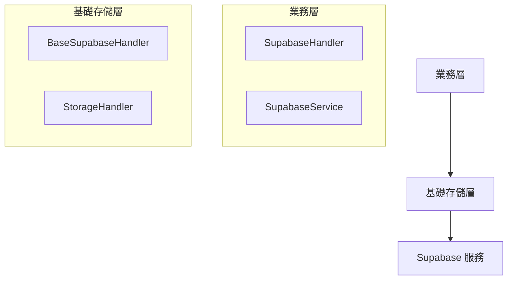

# Supabase 處理器架構設計

## 概述

本架構採用分層設計，將 Supabase 數據存儲功能分為基礎存儲層和業務層，以實現更好的代碼組織和職責分離。

## 架構圖



## 組件說明

### 1. 基礎存儲層

#### 1.1 StorageHandler
- 位置：`persistence/core/base.py`
- 職責：定義存儲處理器的基本接口
- 功能：
  - 提供通用的存儲操作接口
  - 定義錯誤處理機制
  - 提供日誌記錄功能

#### 1.2 BaseSupabaseHandler
- 位置：`persistence/handlers/supabase_handler.py`
- 職責：實現 Supabase 的基礎存儲功能
- 功能：
  - 數據序列化和反序列化
  - 錯誤處理和日誌記錄
  - 數據備份
  - 提供完整的 CRUD 操作
  - 支持數據查詢和統計

### 2. 業務層

#### 2.1 SupabaseHandler
- 位置：`autoflow/services/supabase/handler.py`
- 職責：提供業務層的數據訪問接口
- 功能：
  - 封裝基礎存儲層的操作
  - 提供簡化的 API
  - 處理業務特定的邏輯

#### 2.2 SupabaseService
- 位置：`autoflow/services/supabase/service.py`
- 職責：實現具體的業務邏輯
- 功能：
  - 用戶管理
  - 對話記錄管理
  - 圖片存儲管理

## 數據流

1. 業務層調用：
   ```python
   service = SupabaseService()
   user = await service.create_user(telegram_id=123456)
   ```

2. 業務層處理器：
   ```python
   handler = SupabaseHandler(config)
   result = await handler.create('users', data)
   ```

3. 基礎存儲層：
   ```python
   base_handler = BaseSupabaseHandler(config)
   result = await base_handler.create(table, data)
   ```

## 優點

1. **職責分離**
   - 基礎存儲層專注於數據存儲
   - 業務層專注於業務邏輯

2. **代碼復用**
   - 避免重複實現相同功能
   - 統一錯誤處理和日誌記錄

3. **靈活性**
   - 可以輕鬆替換底層存儲實現
   - 業務層可以根據需要擴展功能

4. **維護性**
   - 代碼更容易維護和測試
   - 錯誤處理更統一

## 使用示例

### 初始化

```python
# 業務層初始化
config = SupabaseConfig(
    url=os.getenv('SUPABASE_URL'),
    key=os.getenv('SUPABASE_KEY')
)
service = SupabaseService()
```

### 基本操作

```python
# 創建用戶
user = await service.create_user(
    telegram_id=123456,
    username='test_user'
)

# 獲取用戶
user = await service.get_user(123456)

# 創建對話
conversation = await service.create_conversation(
    user_id=user['id'],
    message='Hello',
    response='Hi'
)
```

## 錯誤處理

所有層級都實現了統一的錯誤處理機制：

1. 基礎存儲層錯誤：
   - `StorageError`
   - `NotFoundError`
   - `ValidationError`
   - `ConnectionError`

2. 業務層錯誤處理：
   - 捕獲並轉換基礎層錯誤
   - 提供業務相關的錯誤信息

## 擴展性

架構設計支持以下擴展：

1. 添加新的存儲實現
2. 擴展業務功能
3. 添加新的數據類型支持
4. 實現數據遷移功能 