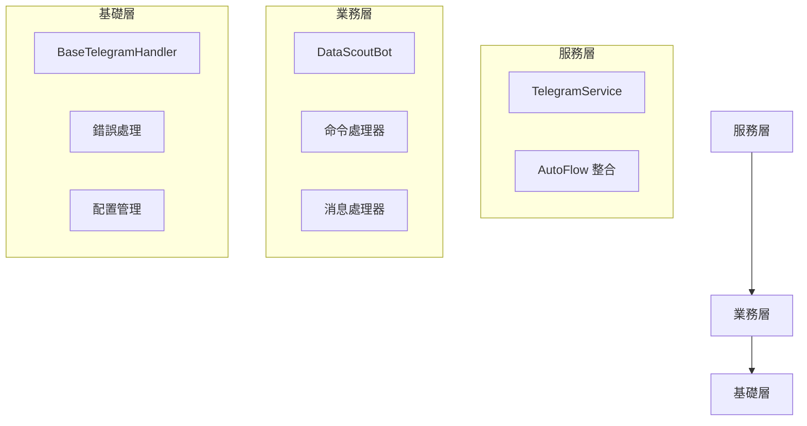

# DataScout Telegram Bot

DataScout Telegram Bot 是 DataScout 爬蟲框架的 Telegram 機器人介面，採用分層架構設計，允許使用者通過 Telegram 平台便捷地操控爬蟲任務、追蹤狀態並獲取結果。

## 架構設計

### 分層結構



### 組件說明

#### 1. 基礎層
- **BaseTelegramHandler**：提供核心 Bot 功能
  - Bot 初始化和配置
  - 生命週期管理
  - 錯誤處理
  - 日誌記錄

#### 2. 業務層
- **DataScoutBot**：實現特定業務邏輯
  - 命令註冊
  - 消息處理
  - 回調處理
  - 圖片處理

#### 3. 服務層
- **TelegramService**：提供高級服務接口
  - 服務初始化
  - 消息發送
  - 狀態管理
  - AutoFlow 整合

## 功能特色

- 🔄 **爬蟲控制**：啟動、排程和取消爬蟲任務
- 📊 **狀態監控**：實時追蹤任務狀態與進度
- 📋 **結果處理**：查看和匯出不同格式的爬蟲結果
- 📸 **圖像分析**：使用 Google Gemini AI 分析上傳的圖片內容
- 🔍 **文字提取**：從圖片中識別與提取文字內容
- 👥 **多用戶支援**：支援多用戶訪問，具有身份驗證機制
- 🔒 **權限控制**：區分普通用戶和管理員權限
- ⏱️ **頻率限制**：防止濫用的請求頻率控制

## 可用指令

### 基本指令
- `/start` - 開始使用機器人
- `/help` - 顯示幫助訊息

### 爬蟲操作
- `/crawl [URL] [選項]` - 啟動爬蟲任務
- `/schedule [URL] [選項] [時間]` - 排程爬蟲任務
- `/cancel [任務ID]` - 取消爬蟲任務

### 狀態查詢
- `/status [任務ID]` - 查詢特定任務狀態
- `/list` - 列出所有進行中的任務
- `/history` - 顯示歷史任務

### 結果處理
- `/result [任務ID]` - 獲取任務結果
- `/export [任務ID] [格式]` - 匯出特定格式的結果

### 圖像處理
- `/image` - 顯示圖像分析功能說明
- 直接發送圖片 - 自動分析圖片內容並提供互動按鈕
- 發送圖片時添加說明 - 使用自定義提示詞引導分析

### 管理員指令
- `/system` - 查看系統狀態
- `/alltasks` - 列出所有任務
- `/kill [任務ID]` - 強制終止任務

## 安裝與設定

### 環境需求

- Python 3.8+
- DataScout 爬蟲框架
- 有效的 Telegram Bot Token

### 安裝步驟

1. 安裝所需依賴：
   ```bash
   pip install -r telegram_bot/requirements.txt
   ```

2. 配置環境變數：
   - 複製 `telegram_bot.env.example` 為 `.env`
   - 編輯 `.env` 文件，填入 Telegram Bot Token 和其他配置

3. 啟動機器人：
   ```bash
   python run_telegram_bot.py
   ```

## 使用方式

### 1. 作為獨立 Bot

```python
from telegram_bot.bot import DataScoutBot

bot = DataScoutBot(config={
    "token": "your_token",
    "proxy_url": "http://proxy.example.com:8080"
})
await bot.start()
```

### 2. 作為服務組件

```python
from autoflow.services.telegram import TelegramService

service = TelegramService(config={
    "token": "your_token",
    "proxy_url": "http://proxy.example.com:8080"
})
await service.start()
```

### 3. 作為流程組件

```python
from autoflow.flows.telegram_flow import TelegramFlow

flow = TelegramFlow(config={
    "token": "your_token",
    "proxy_url": "http://proxy.example.com:8080"
})
await flow.start()
```

## 配置選項

在 `.env` 文件中可以配置以下選項：

- `DATASCOUT_BOT_TOKEN`：Telegram Bot Token
- `ADMIN_USER_IDS`：管理員用戶 ID 列表
- `AUTHORIZED_USERS`：授權用戶 ID 列表
- `REQUIRE_AUTH`：是否啟用授權檢查
- `GEMINI_API_KEY`：Google Gemini API 金鑰，用於圖像分析功能

### 進階配置

```python
config = {
    "token": "your_token",
    "proxy_url": "http://proxy.example.com:8080",  # 代理設置
    "connect_timeout": 30,  # 連接超時
    "read_timeout": 30,     # 讀取超時
    "write_timeout": 30     # 寫入超時
}
```

## 錯誤處理

所有層級都實現了統一的錯誤處理機制：

1. 基礎層錯誤：
   - `BotError`：基礎錯誤類
   - `BotInitializationError`：初始化錯誤
   - `BotConfigError`：配置錯誤
   - `BotRuntimeError`：運行時錯誤

2. 業務層錯誤：
   - `HandlerError`：處理器錯誤
   - `MiddlewareError`：中間件錯誤

## 注意事項

- 爬蟲活動應遵守目標網站的使用條款和相關法規
- 避免頻繁請求以防止被封鎖
- 妥善保管 Bot Token 和授權資訊，避免未授權訪問
- 確保正確配置錯誤處理和日誌記錄

## 授權條款

參見 DataScout 專案的授權條款
