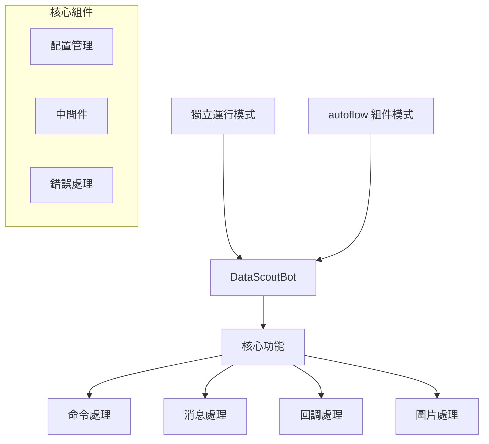

# Telegram Bot 架構設計

## 概述

本架構採用模組化設計，使 Telegram Bot 既能獨立運行，也能作為 `autoflow` 的組件被重用。

## 架構圖



## 組件說明

### 1. 核心組件

#### 1.1 DataScoutBot
- 位置：`telegram_bot/bot.py`
- 職責：Bot 的核心類別
- 功能：
  - 初始化 Bot 實例
  - 註冊命令和處理器
  - 管理 Bot 生命週期
  - 支持獨立運行和組件模式

#### 1.2 配置管理
- 位置：`telegram_bot/config.py`
- 職責：管理 Bot 配置
- 功能：
  - 環境變量管理
  - 授權控制
  - 請求限制
  - 任務設定

### 2. 功能模組

#### 2.1 命令處理
- 位置：`telegram_bot/commands/`
- 職責：處理 Bot 命令
- 功能：
  - 註冊命令
  - 命令處理邏輯
  - 命令權限控制

#### 2.2 消息處理
- 位置：`telegram_bot/handlers/message_handlers.py`
- 職責：處理用戶消息
- 功能：
  - 文本消息處理
  - 消息過濾
  - 消息轉發

#### 2.3 回調處理
- 位置：`telegram_bot/handlers/callback_handlers.py`
- 職責：處理回調查詢
- 功能：
  - 按鈕回調
  - 內聯查詢
  - 回調數據處理

#### 2.4 圖片處理
- 位置：`telegram_bot/handlers/image_handlers.py`
- 職責：處理圖片相關操作
- 功能：
  - 圖片上傳
  - 圖片處理
  - 圖片存儲

### 3. 中間件

#### 3.1 中間件系統
- 位置：`telegram_bot/middlewares/`
- 職責：處理請求/響應流程
- 功能：
  - 用戶認證
  - 請求限制
  - 日誌記錄
  - 錯誤處理

## 使用模式

### 1. 獨立運行模式

```python
from telegram_bot.bot import DataScoutBot

# 直接運行 Bot
if __name__ == "__main__":
    DataScoutBot.run()
```

### 2. 組件模式

```python
from telegram_bot.bot import DataScoutBot
from autoflow.core import AutoFlow

# 在 autoflow 中使用
class MyFlow(AutoFlow):
    def __init__(self):
        self.bot = DataScoutBot()
        
    async def start(self):
        await self.bot.start()
        
    async def stop(self):
        await self.bot.stop()
```

## 配置管理

### 1. 環境變量

```bash
# 必需配置
DATASCOUT_BOT_TOKEN=your_bot_token
ADMIN_USER_IDS=123456,789012
AUTHORIZED_USERS=123456,789012

# 可選配置
REQUIRE_AUTH=True
GEMINI_API_KEY=your_api_key
```

### 2. 運行時配置

```python
from telegram_bot.config import get_config

# 獲取配置
token = get_config("TELEGRAM_BOT_TOKEN")
admin_ids = get_config("ADMIN_USER_IDS")
```

## 錯誤處理

1. 全局錯誤處理：
   - 捕獲所有未處理的異常
   - 記錄錯誤日誌
   - 向用戶發送友好的錯誤消息

2. 業務錯誤處理：
   - 命令執行錯誤
   - 消息處理錯誤
   - 回調處理錯誤

## 擴展性

架構設計支持以下擴展：

1. 添加新的命令
2. 擴展消息處理器
3. 自定義中間件
4. 添加新的回調處理器
5. 擴展圖片處理功能 